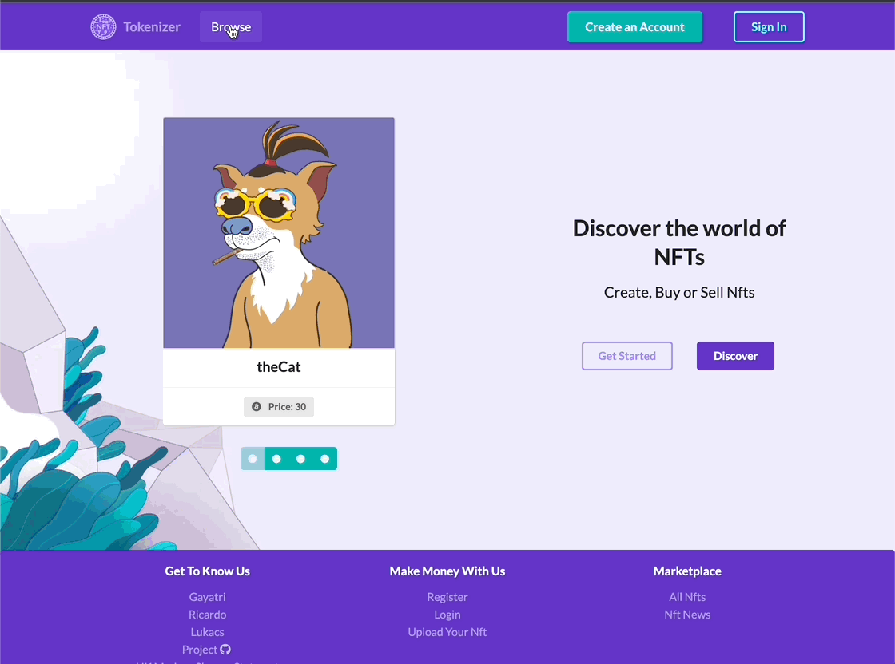
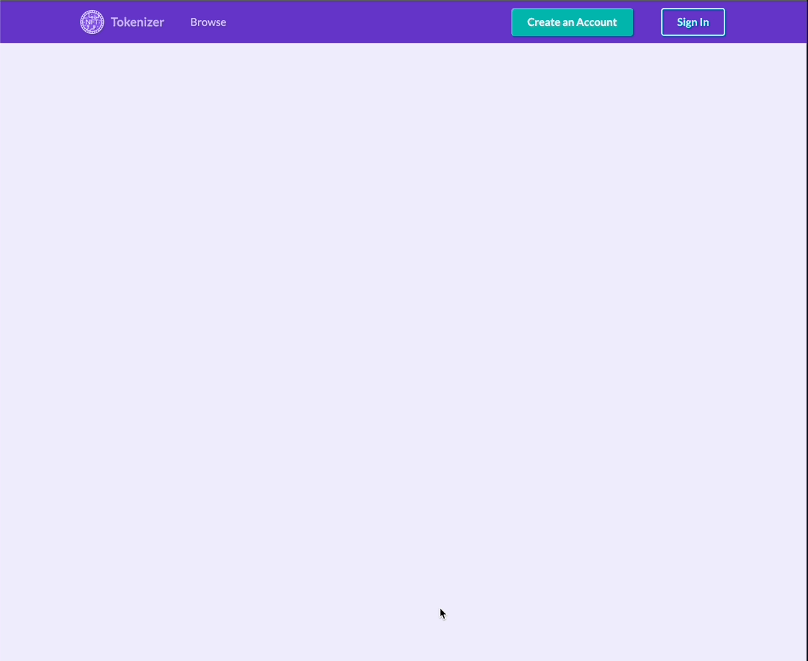
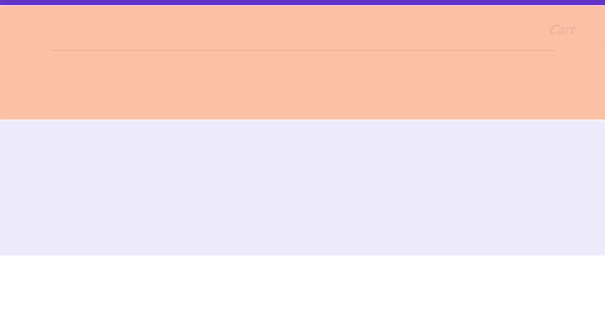

# Tokenizer
---

## Overview

A full-stack MERN(Mongo, Express, React, Node.js) website built over a week. 

Built together with [Lukacs Papp](https://github.com/lukacspapp) and [Gayatri Rajgor](https://github.com/gayatrirajgor) We wanted to tackle e-commerce and chose to do a clone of OpenSea.

[Tokenizer](https://tokenized.herokuapp.com/)

## Brief
---
* Build a full-stack application.
* Use an Express API to serve data from a Mongo database.
* Consume the API with a separate, React front end.
* Be a complete product which most likely means multiple relationships and CRUD functionality for at least a couple of models.
* Be deployed online so it’s publicly accessible.

## Technologies Used
---
### Back end:
* MongoDB
* Mongoose
* Node.js
* Express
* JSONWebToken
* bcrypt
### Front end:
* React
* React Router
* Pure React Carousel
* Semantic UI React
* recharts 
* Axios
* date-fns
* Animate CSS
### Collaboration
* Google Jamboard
* Asana
* Slack
* Zoom
* Git
* GitHub
* Insomnia

## Approach
---

### Planning
As we were taking design cues from an existing site, we created some simple wireframes using Google Jamboard to serve as a reference. 

We anticipated most of our time would need to be spent on the front end, and so we decided to jointly code the back-end while screen sharing so that we would all be familiar with the data our API would serve to the front end.

Initially we wrote a bit of pseudocode so that we could track what we thought would be needed for an MVP, as well as to ideate some stretch goals. 
```javascript
// ! models needed

// ? NFT
// ! data attributes:
// todo nft token?
// todo image as string
// todo category as string
// todo current price // could maybe get from transactions?
// todo current Owner / could maybe get from transactions?
// todo [transactions as embedded relationship]
// todo [some sort of interaction counter for trending? -stretch]

// ? transaction schema
// todo type of transaction
// todo from
// todo to
// todo price
// todo date

// // ? collection as stretch
// // todo name
// // todo [nfts in the colletcion in an array reference]

// ? User
// ! attributes: 
// todo username
// todo email
// todo password
// todo owned NFTs as array?
// todo amount of transactions?
// todo recent transactions? (limit 3?)


// ? categories could come from a front-end dropdown
```

Following this, we decided on using Asana to track what work remained to be done and who would be doing it. Additionally, we would all stay in touch via Slack or Zoom, and to all be on zoom when merging so that we could quickly solve any merge conflicts or git errors.

### Back end
---
We chose to only use 2 models, but to include multiple embedded and reverse relationships in order to build out our site. We would have one collection encompassing the user data, and by extension the shopping cart functionality, while the other collection would hold all NFTs, as well as any transactions that had occurred for each.

```javascript
const cartItem = new mongoose.Schema({
  item: { type: mongoose.Schema.ObjectId, ref: 'Nft', required: true, unique: true, sparse: true }
})

const userSchema = new mongoose.Schema({
  username: { type: String, required: true, unique: true, maxlength: 30 },
  email: { type: String, required: true, unique: true },
  password: { type: String, required: true },
  cart: [cartItem]
},
{
  timestamps: true
})

userSchema.virtual('owned', {
  ref: 'Nft',
  localField: '_id',
  foreignField: 'owner'
})

userSchema.set('toJSON', {
  virtuals: true,
  transform(_doc,json) {
    delete json.password
    return json
  }
})

cartItem.virtual('details', {
  ref: 'Nft',
  localField: 'cartItem',
  foreignField: '_id'
})

cartItem.set('toJson',{
  virtuals: true
})

```
```javascript
const transactionSchema = new mongoose.Schema({
  type: { type: String, required: true },
  from: { type: mongoose.Schema.ObjectId, ref: 'User' },
  to: { type: mongoose.Schema.ObjectId, ref: 'User', required: true },
  price: { type: Number, required: true }
},
{
  timestamps: true
})

const nftSchema = new mongoose.Schema({
  token: { type: String },
  image: { type: String, required: true, unique: true },
  category: { type: String },
  name: { type: String, required: true, unique: true },
  owner: { type: mongoose.Schema.ObjectId, ref: 'User', required: true },
  available: { type: Boolean, required: true },
  currentPrice: { type: Number, min: 0 },
  transactions: [transactionSchema]
})

```

### Front end
---
In order to meet our deadline, we met on zoom each morning to divide tasks, and periodically throughout the day to help solve issues, rubber duck, or talk about how what we had done might affect components we knew others to be working with. I focused on the product index grid, the detail page, and the initial cart & purchase functionality. 

#### Product Index



The main challenge I encountered here was in displaying the dates our backend was applying to transactions for each NFT. We had designed our backend to include timestamps and to create a transaction for each NFT, even if it was just its creation, however those weren’t very useful to us without transforming them. From the index component I used a get request to send all the NFTs through a map function to render cards, and in that child component used the *date-fns* library to make the dates readable. 

```javascript
const transactions = item.transactions
  const date = new Date(transactions.slice(-1)[0].createdAt)
  const formattedDate = format(date, 'dd MMMM yy H: mm')
  const transactionText = transactions.slice(-1)[0].type
  const formattedText = transactionText.charAt(0).toUpperCase() + transactionText.slice(1)
  const address = item._id
  
```
```jsx
  
  return (
    <Card  as='a' href={`/browse/${address}`} key={index} className='animate__animated animate__slideInRight animate__slow'>
      <Image 
        src={item.image}
        rounded
        size='large'
      />
      <Card.Content>
        <Card.Header>{item.name}</Card.Header>
        <Card.Meta>{item.category}</Card.Meta>
      </Card.Content>
      <Card.Content extra>
        <Label><Icon name='bitcoin'/>Price: {item.available ? item.currentPrice : 'Unlisted'}</Label>
        <Divider />
        <Label>
          <Icon name='barcode' />
          <Label.Detail>Last transaction: {formattedText} at {formattedDate}</Label.Detail>
        </Label>
      </Card.Content>
    </Card>
  )

```

#### Product Detail



The biggest challenge on this page was all of the conditional rendering - for instance we did not want a user to be able to add the same NFT to their cart if it was already in it, and so multiple requests needed to go to the back end to get the user (and their cart). 

```javascript
useEffect(() => {
    const getData = async() => {
      try {
        const { data } = await axios.get(`/api/all/${id}`)
        setItem(data)
      } catch (error) {
        console.log(error)
      }
    }
    const getUser = async () => {
      if (userIsAuthenticated()) {
        try {
          const { data: { cart } } = await axios.get('/api/profile',
            {
              headers: { Authorization: `Bearer ${getTokenFromLocalStorage()}` }
            }
          ) 
          settheCart(cart)
        } catch (error) {
          console.log(error)
        }
      }
    }
    getData()
    getUser()
  },[id])

  useEffect(() => {
    if (thecart) {
      if (thecart.map(item=> item.item).filter(item => item === id).length) {
        setAdded(true)
      } else setAdded(false)
    }
  },[thecart])

```

Additionally, using Semantic UI React components such as panes, and building in more conditional rendering so that for example, a user could list their NFT for sale but someone unauthorized would see a warning was a challenge.

```javascript
const panes = [
    {
      menuItem: 'Price History', render: () => (
        <Tab.Pane>
          {
            !isEmpty(item) ? 
              <PricingDetails item={ item }/>
              :
              <Placeholder style={{ height: 150, width: 150 }}>
                <Placeholder.Image />
              </Placeholder>
          }
        </Tab.Pane>
      )
    },
    {
      menuItem: 'Edit Details', render: () => (
        <Tab.Pane>
          { userIsOwner(item.owner.id) ?
            <NftEdit
              {...item}
              id={id}
            />
            :
            <Message  
              error
              icon
            >
              <Icon name='meh outline' />
              <Message.Content>
                <Message.Header>
                  Permission Denied!
                </Message.Header>
                You do not have permission to edit this NFT.
              </Message.Content>
            </Message>
          }
        </Tab.Pane>
      )
    }
  ]

```
```jsx

            <Container>
              <Tab menu={{ pointing: true, secondary: true }} panes={panes}/>
            </Container>          

```

Much like OpenSea, we wanted to have some data visualization so that users could see the historical pricing for any given NFT. I ended up using recharts to construct the graph and a custom label to make the x-axis readable, while again using date-fns to transform the transaction dates.


```javascript
 const dataArray = item.transactions.filter(item => item.type === 'sale').map(sale => {
    const date = new Date(sale.createdAt)
    const formattedDate = format(date, 'd MMM yy H:m')
    const price = sale.price
    return { date: formattedDate, price: price }
  })

class CustomLabel extends PureComponent {
    render() {
      const { x, y, stroke, payload } = this.props
      return (
        <g transform={`translate(${x},${y})`}>
          <text x={0} y={0} dy={10} fontSize={10} fill="#666" transform="rotate(-25)">
            <tspan textAnchor='end' x='0'>{payload.value.split(' ').slice(0, 3).join(' ')}</tspan>
            <tspan textAnchor='end' x='0' dy='20'>{payload.value.split(' ').slice(-1).join('')}</tspan>
          </text>
        </g>
      )
    }
  }

```
```jsx
<ResponsiveContainer>
          <AreaChart
            data={dataArray}
            margin={{
              top: 10,
              right: 15,
              left: 0,
              bottom: 40
            }}
          >
            <CartesianGrid strokeDasharray='3 3' />
            <XAxis interval={0} dataKey='date' tick={<CustomLabel />} />
            <YAxis dataKey='price' />
            <Tooltip />
            <Area type='monotone' dataKey='price' stroke='#8884d8' fill='#8884d8' />
          </AreaChart>
        </ResponsiveContainer>

```


#### Cart



Implementing a functioning cart required some revisions and additions to the back end code, as we had not initially coded in a way for our front end to change the user model. Specifically, `sparse: true` was added to the embedded cart item, as well as the handling for adding and removing items(both in bulk and individually in the case of removing).

```javascript
export const addToCart = async (req,res) => {
  try {
    const { cart }  = req.body

    const user = await User.findById(req.currentUser._id)

    if (!user) throw new Error()

    const updatedCart = await User.findOneAndUpdate(
      { _id: req.currentUser._id },
      { $push: {
        cart
      }
      },
      { returnDocument: 'after' }
    )
    return res.status(202).json(updatedCart)
  } catch (error) {
    return res.sendStatus(404)
  }
}

export const removeOneFromCart = async (req,res) => {
  try {
    const { item }  = req.body
    const user = await User.findById(req.currentUser._id)
    if (!user) throw new Error()
    const updatedCart = await User.findOneAndUpdate(
      { _id: req.currentUser._id },
      { $pull: { 'cart': { 'item': item._id } } },
      { returnDocument: 'after' }
    )
    return res.status(202).json(updatedCart)
  } catch (error) {
    console.log(error)
    return res.sendStatus(404)
  }
}

export const clearCart = async (req,res) => {

  try {
    const user = await User.findById(req.currentUser._id)
    if (!user) throw new Error()
    const updatedUser = await User.findByIdAndUpdate(req.currentUser._id,
      { $set: { 'cart': [] } },
      { multi: true,returnDocument: 'after' }
    )
    return res.status(202).json(updatedUser)  
  } catch (error) {
    console.log(error)
    return res.sendStatus(404)
  }
}

```

From here the challenge was to properly set up the requests from the front end, and how to handle checking out a cart with multiple items. The former I was able to solve for with trial and error in terms of structuring the request objects, and the latter required the use of the Promise object to make the array map being sent to the back end async aware:
```javascript
 const handleCheckOut = async () => {
    let isError = false
    const currentUser = getPayload()
    await Promise.all(userInfo.map(async (nft)=> {
      try {
        await axios.put(`api/all/${nft._id}`,
          {
            owner: currentUser.sub,
            available: false,
            currentPrice: null,
            transactions: {
              type: 'sale',
              from: nft.owner._id,
              to: currentUser.sub,
              price: nft.currentPrice
            }
          },
          {
            headers: { Authorization: `Bearer ${token}` }
          }
        )
      } catch (error) {
        console.log(error)
        isError = true
      }
    }))
    if (!isError) handleClearCart()
  }

```

This use of the Promise object was also used to populate multiple item details once the contents of the cart were retrieved on every re-render due to a cart change.

Additionally, finding that I could send a body to the back end with a delete request was very helpful in avoiding additional changes or unnecessary boolean statements being added into the request to handle the deletion of a single cart item vs clearing the entire cart.
```javascript
const handleRemoveOne = async (cartItem) => {
    try {
      const { data: { cart } } = await axios.delete('/api/profile/cart',
        {
          headers: { Authorization: `Bearer ${token}` },
          data: { item: { _id: cartItem } }
        }
      )
      const populated = await Promise.all(cart.map(async (item) => {
        try {
          const { data } = await axios.get(`/api/all/${item.item}`)
          return data
        } catch (error) {
          console.log(error)
        }
      }))
      setuserInfo(populated)

    } catch (error) {
      console.log(error)
    }
  }

```

## Wins
---
* This was my first time working with a new CSS framework, and becoming comfortable with its conventions and shorthands took some adjustment, but at the end I was really enjoying what I could create with it.
* Cart functionality - As we set out to create an e-commerce site this was a hard requirement for our MVP. While challenging, I found coding the back end functions and the front end requests we needed for this to be very interesting and a huge relief once working
* Collaboration and Organization - Spending some time at the beginning to outline what we wanted, as well as jointly coding most of the back end so we would all be familiar with the requests and the database I think was really helpful. Additionally, being on zoom to resolve blockers and work through merge conflicts I think helped us stay on track.
	
## Challenges
---

* Conditional rendering and error handling - there was a lot of errors at the beginning that were due to our app attempting to render data that hadn’t yet been loaded, and as we added features and data that we only wanted displayed under certain conditions the code became increasingly complex, with a few places where there were a conditional render that included a ternary, where one of the options was an array map that itself had an if/then statement.
* Non-default methods for the back end - Implementing the cart required using the `$pull` ,  `$set` , and  `$push`  methods for removing and adding items to the cart, which was unfamiliar at first. Moreover, I encountered a lot of errors until reading more about the default behavior of the database and finding out the models required revisions to make it work.
	
## Future functionality 
---

* Account maintenance - specifically the ability to delete an account or change a password.
* Working payment feature - we had wanted to implement Stripe, but ended up not having the time to do so.
* Image upload - in the current implementation adding an NFT takes a URL of an already hosted image, but being able to directly upload one was another of our stretch goals.
